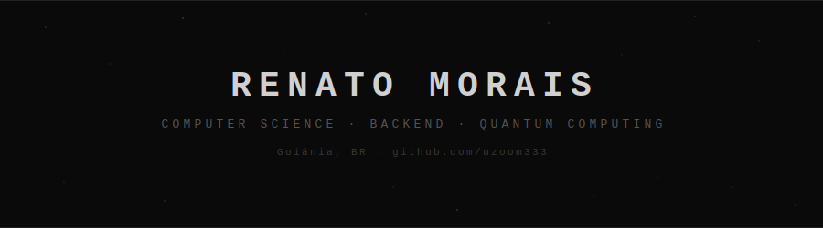

<p align="center">
  
</p>

<p align="center">
  <a href="https://www.linkedin.com/in/renato-morais-mundim-filho-88919238b/">
    
  </a>
  <a href="mailto:uzxcontato@gmail.com">
    
  </a>
  
</p>

---

### `> whoami`

Computer Science student from Goiânia, Brazil. Interested in quantum computing and how it can reshape the way we solve complex problems.

Currently diving into quantum software development with Qiskit while conducting undergraduate research in Linear Algebra and Linear Programming.

---

### `> cat about.md`

```
🎓  Computer Science
🔬  Undergraduate researcher — Linear Algebra / Linear Programming
☕  Completed FullStack Java track (Java, Spring Boot, Docker)
🔭  Now focused on Python + Quantum Computing (IBM Qiskit)
🧮  I enjoy the intersection between mathematics and code
```

---

### `> ls --skills`

<p align="center">
  
  
  
  
  
  
  
  
  
</p>

---

### `> ls ~/projects`

| | Repo | About |
|---|---|---|
| ⚛️ | [quantum-python-learning](https://github.com/uzoom333/quantum-python-learning) | Python + Quantum Computing — Qiskit & IBM Quantum studies |
| 🔬 | [ic-algebra-linear](https://github.com/uzoom333/ic-algebra-linear) | Undergraduate Research — Linear Algebra & Linear Programming |
| ⚡ | [scoreboard-simulator](https://github.com/uzoom333/scoreboard-simulator) | CDC 6600 Scoreboard Simulator — dynamic scheduling visualization |
| ☕ | [almofadinha](https://github.com/uzoom333/almofadinha) | Java Learning Journey — FullStack Java track exercises |
| 🚛 | [projetopaa](https://github.com/uzoom333/projetopaa) | Optimal Driver-Route Assignment — Algorithm Analysis (PAA) |
| 🐍 | [pythonlearning](https://github.com/uzoom333/pythonlearning) | Python from zero — daily exercises and notes |

---

### `> git log --oneline`

```
🎯  Preparing for IBM Qiskit Developer Certification
📚  Studying quantum computing through IBM Quantum Learning
🔬  Conducting research in Linear Algebra & Linear Programming
⚡  Built a CDC 6600 Scoreboard Simulator
☕  Completed FullStack Java learning track
🐍  Learned Python fundamentals
```

---

<p align="center">
  
  
</p>

<p align="center">
  
</p>

---

<p align="center">
  <sub>⚡ <i>"The best way to predict the future is to create it."</i></sub>
</p>
