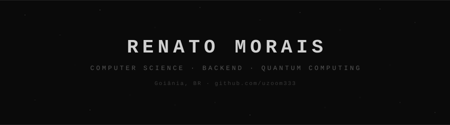

<p align="center">
  
</p>

<p align="center">
  <a href="https://www.linkedin.com/in/renato-morais-mundim-filho-88919238b/"></a>
  <a href="mailto:uzxcontato@gmail.com"></a>
</p>

### `> whoami`

```text
Computer Science student and undergraduate researcher
Goiânia, Goiás, Brazil
```

I am building a rigorous foundation in mathematics and computation before eventually specializing in AI Engineering. My current work centers on Linear Algebra, mathematical optimization, scientific computing, data analysis, and introductory quantum computing.

### `> cat current-journey.md`

```text
🎓 Computer Science student at PUC Goiás
🔬 Undergraduate research in Linear Algebra and mathematical optimization
🐍 Scientific Python through reproducible modeling projects
⚛️ Introductory quantum-computing studies with Qiskit
☕ Continued development of Python and Java fundamentals
```

### `> ls --skills`

`Python` · `Linear Algebra` · `Mathematical Optimization` · `Scientific Computing` · `Data Analysis` · `Qiskit` · `Java` · `Git` · `GitHub`

### `> ls ~/featured-projects`

#### [Metro Station Mathematical Modeling](https://github.com/uzoom333/metro-station-mathematical-modeling)

An award-winning undergraduate modeling idea documented through a faithful reconstruction and a later computational redevelopment.

**Technical focus:** coupled differential equations, SciPy, numerical validation, scenario analysis, sensitivity analysis, and optimization.

#### [ABR](https://github.com/uzoom333/abr)

An agricultural decision-support CLI that evaluates soybean planting windows in Goiás using official Brazilian ZARC data.

**Technical focus:** Python, API integration, date modeling, caching, data interpretation, and command-line workflows.

#### [Quantum Python Learning](https://github.com/uzoom333/quantum-python-learning)

An academic learning portfolio connecting Linear Algebra exercises with introductory quantum-computing experiments.

**Technical focus:** mathematical foundations, NumPy, Jupyter, Qiskit, circuits, and simulation.

#### [Scoreboard Simulator](https://github.com/uzoom333/scoreboard-simulator)

An interactive visualization of the CDC 6600 Scoreboard algorithm and its treatment of instruction hazards.

**Technical focus:** computer architecture, dynamic scheduling, HTML, CSS, and JavaScript.

#### [Driver-to-Route Assignment Optimization](https://github.com/uzxcontato-ui/projetopaa)

A university Algorithm Design project comparing greedy and Hungarian approaches to a bipartite assignment problem.

**Technical focus:** graph algorithms, optimization, Python, SciPy, and data visualization.

#### [CS50P Math Tools](https://github.com/uzoom333/cs50p)

A tested command-line calculator developed as a CS50P final project.

**Technical focus:** Python standard library, function design, input validation, and pytest.

### `> contact --open`

[LinkedIn](https://www.linkedin.com/in/renato-morais-mundim-filho-88919238b/) · [Email](mailto:uzxcontato@gmail.com) · [GitHub](https://github.com/uzoom333)
